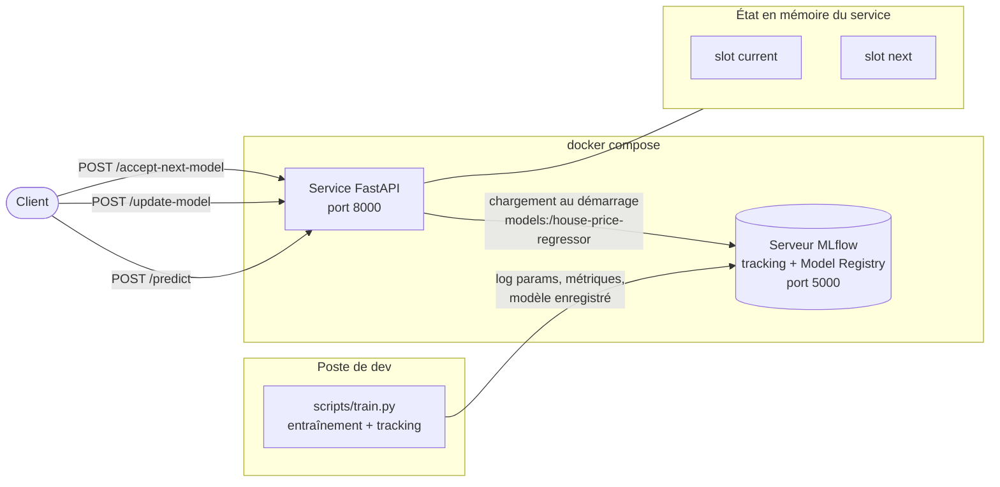
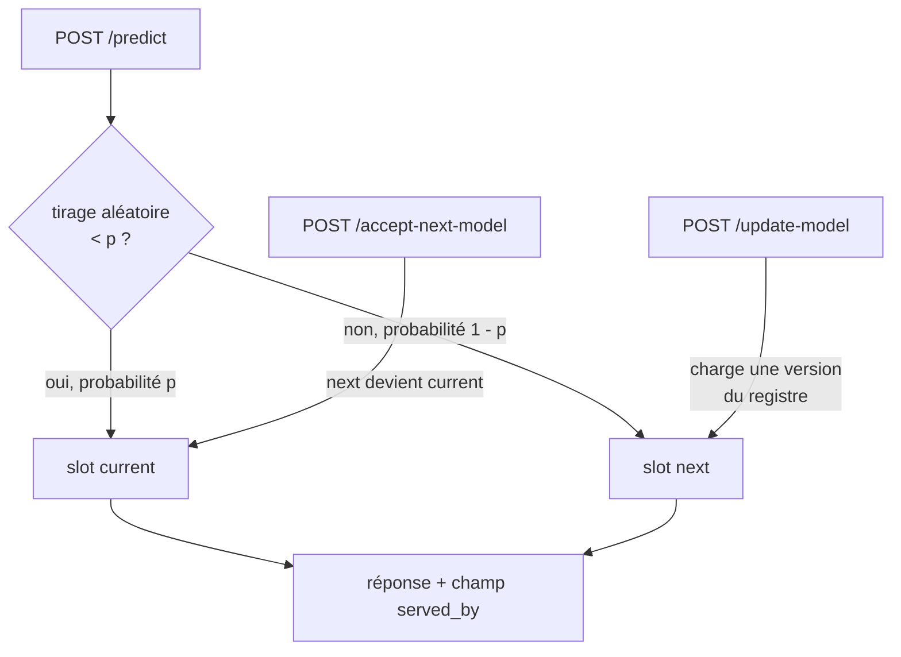

# MLOps - versioning de modèles et déploiement canary

Projet du module *Model versioning and canary deployment* (M2 Mastère Data Engineering & IA, EFREI).

Le but est de gérer le cycle de vie d'un modèle avec MLflow, puis de le servir derrière une API qui applique un déploiement canary : deux modèles chargés en mémoire, un trafic réparti entre les deux, et une promotion explicite quand le nouveau modèle fait ses preuves.

## Architecture



Le modèle n'est jamais copié dans l'image Docker. Il est récupéré au démarrage du conteneur depuis le Model Registry MLflow, ce que le sujet demande explicitement.

## Le routage canary



Au démarrage, `current` et `next` portent le même modèle : aucune requête n'est exposée à autre chose que la version validée tant que personne n'a appelé `/update-model`.

La réponse de `/predict` indique quel slot a servi la prédiction. Sans cette information, un canary est inexploitable : on ne peut pas attribuer une dégradation de métrique à la bonne version.

## Démarrage

```bash
docker compose up -d --build
```

- Interface MLflow : http://localhost:5000
- API : http://localhost:8001 (le port 8000 est pris par un autre projet sur ce poste), documentation interactive sur http://localhost:8001/docs

Puis entraîner un premier modèle depuis le poste de dev :

```bash
pip install -r scripts/requirements.txt
export MLFLOW_TRACKING_URI=http://localhost:5000
python scripts/train.py --n-estimators 200 --max-depth 8
```

Relancer avec un hyperparamètre différent pour vérifier que les deux runs coexistent dans l'interface :

```bash
python scripts/train.py --n-estimators 50 --max-depth 4
```

Chaque exécution enregistre le modèle dans le Model Registry sous le nom `house-price-regressor`, en incrémentant la version.

## Les endpoints

| méthode | route | rôle |
|---|---|---|
| GET | `/health` | dit si les deux slots portent un modèle, et sinon pourquoi |
| GET | `/model-status` | versions chargées, probabilité de routage, compteur de requêtes par slot |
| POST | `/predict` | prédiction, avec le slot qui a répondu |
| POST | `/update-model` | charge une version du registre dans le slot `next` |
| POST | `/accept-next-model` | promeut `next` en `current` |

Exemple de cycle complet :

```bash
# état initial, les deux slots portent la version 1
curl http://localhost:8001/model-status

# une prédiction
curl -X POST http://localhost:8001/predict \
  -H "Content-Type: application/json" \
  -d '{"features": {"size": 150, "nb_rooms": 3, "garden": 1, "orientation": "Sud"}}'

# on met la version 2 en canary, sans toucher au trafic principal
curl -X POST http://localhost:8001/update-model \
  -H "Content-Type: application/json" -d '{"version": "2"}'

# on observe la répartition
curl http://localhost:8001/model-status

# la version 2 tient la route, on la promeut
curl -X POST http://localhost:8001/accept-next-model
```

## Tests

Les tests tournent sans Docker et sans serveur MLflow : le chargeur est remplacé par un modèle bouchon, ce qui rend le routage canary déterministe et testable.

```bash
cd service
pip install -r requirements.txt
pytest tests -v
```

Un script de vérification en conditions réelles est fourni à part, à lancer une fois la pile démarrée :

```bash
python service/tests/check_predict_live.py
```

## Structure du dépôt

```
docker-compose.yml        pile complète, MLflow et API
mlflow/Dockerfile         serveur de tracking
scripts/train.py          entraînement, tracking, enregistrement au registre
scripts/requirements.txt
service/Dockerfile        image de l'API, sans le modèle
service/app/config.py     configuration par variables d'environnement
service/app/mlflow_loader.py  chargement depuis le registre, avec réessais
service/app/canary_state.py   les deux slots et la décision de routage
service/app/schemas.py    schémas Pydantic d'entrée et de sortie
service/app/routes.py     les routes HTTP
service/app/main.py       assemblage et chargement au démarrage
service/tests/            tests unitaires et script de vérification en direct
docs/reponses.md          réponses écrites aux questions du TP
```

## Configuration

| variable | défaut | rôle |
|---|---|---|
| `MLFLOW_TRACKING_URI` | `http://localhost:5000` | adresse du serveur MLflow |
| `MODEL_NAME` | `house-price-regressor` | nom dans le Model Registry |
| `CANARY_PROBABILITY_CURRENT` | `0.9` | part du trafic servie par `current` |

## Deux pieges rencontres en montant la pile

**Les artefacts doivent transiter par le serveur MLflow.** Avec un simple
`--default-artifact-root /mlflow/artifacts`, le client d'entrainement ecrit les
artefacts a ce chemin sur SA machine, tandis que le service les cherche au meme
chemin dans SON conteneur. Le modele s'enregistre sans erreur, et le chargement
echoue plus tard avec un fichier introuvable. Le serveur tourne donc avec
`--serve-artifacts` et `--artifacts-destination` : les deux cotes passent par
HTTP et aucun chemin de fichier n'est suppose partage.

**Les types du schema d'API doivent correspondre a la signature du modele.**
MLflow applique la signature au moment de la prediction et refuse de convertir
un `float64` en `int64`. Declarer `bathrooms` en `float` alors que
l'entrainement produit des entiers fait echouer toute prediction reelle avec un
500, pendant que les tests unitaires restent verts puisqu'ils tournent contre un
modele bouchon qui accepte tout. `tests/test_schema_matches_training.py`
compare desormais les noms et les types du schema aux dtypes produits par le
script d'entrainement.

## Choix et limites

Le serveur MLflow est épinglé en version 2.17.2 pour la stabilité de l'image officielle. La documentation de référence citée dans `docs/reponses.md` correspond à la ligne MLflow 3, qui a retiré Recipes et le Deployments Server historique ; rien de ce qui est utilisé ici n'en dépend.

Le stockage du serveur de tracking est un SQLite dans un volume Docker. C'est suffisant pour un poste de développement et clairement insuffisant pour un usage partagé, où il faudrait une base PostgreSQL et un stockage objet pour les artefacts.

L'état canary vit en mémoire du processus. Redémarrer le service recharge les deux slots sur la même version et remet les compteurs à zéro. Une vraie mise en production tiendrait cet état en dehors du processus, ne serait-ce que pour survivre à plusieurs répliques derrière un répartiteur de charge.
